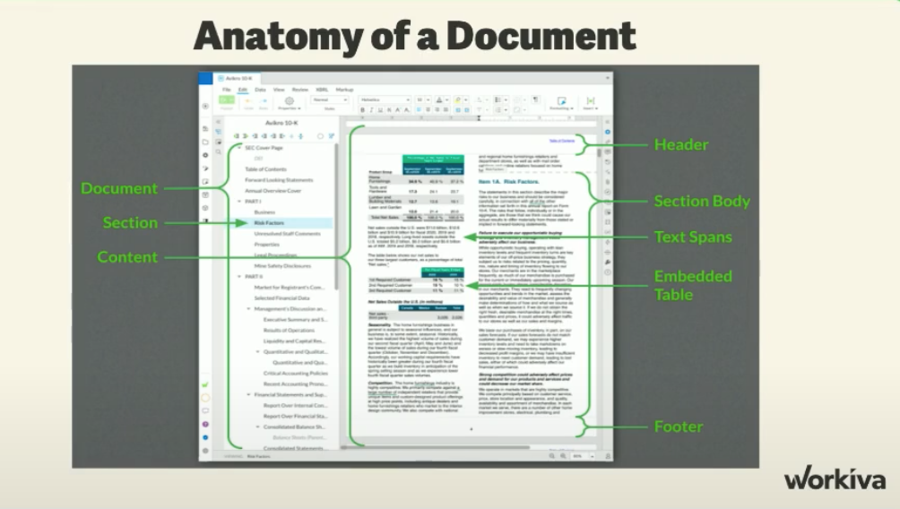
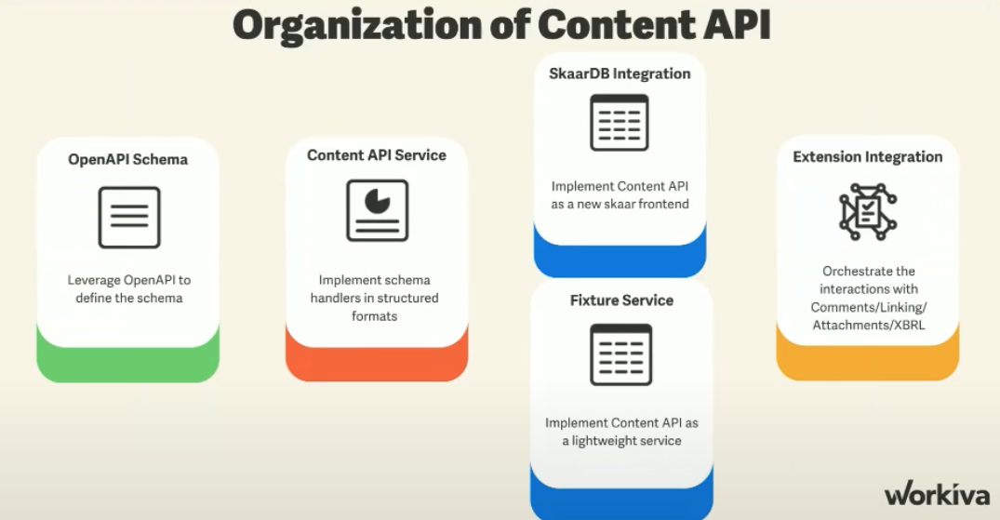
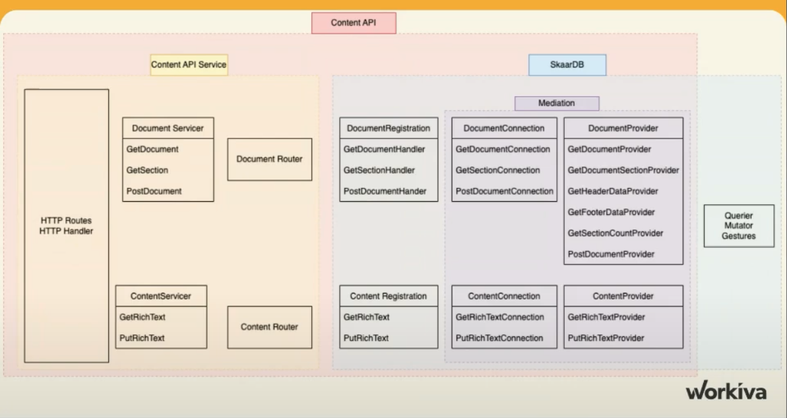

# References 
[ Presentation pdf ](https://workiva.enterprise.slack.com/files/U0VFF6G2D/F04LXGB9SN5/1-25-2023_r_d_meeting.pdf)

[Meeting Recording](https://workiva.enterprise.slack.com/files/U074SKV25/F04L3LNSL5V/r_d_meeting_-_presenter___2023-01-25_11_00_gmt-6_)
# What is Content API
RESTful interface to Document Platform within [[skaardb]]
Tenet: 
1. Decouple content from product 
2. Differentiate product functionality from underlying Content
3. Compartmentalize concept into distinct spheres
4. Design this as framework to make the easy way the best way to develop API

## Anatomy of a document 
Document => Section => Content 
Content => Header, section body, text spans

In the same way, Presentation => Section => Content
Content => Shapes, Text box, etc. 

## Organization of Content API

OpenAPI Schema => ContentAPI service => Separating SkaarDB endpoints and 
ContentAPI endpoints. 

THis resulted in Fixture Service, which is a YAML file that can be stood up by 
itself

User request => Document Servicer => Document Request Handler => Querier Mutator Gestures

Follows the [[ SOLID Design Principles ]]

