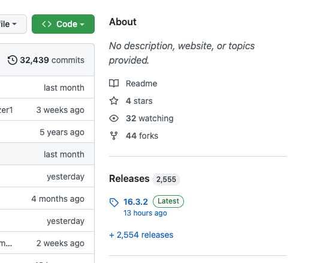
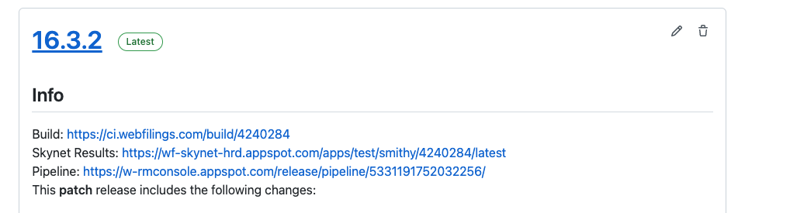
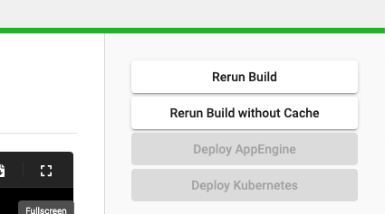
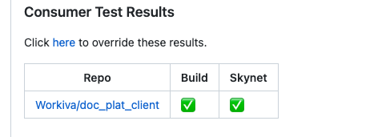

# How to Deploy Builds
## Deploy master
1. Go to the Releases section of your repository.

2. Click on "Build"

3. Click on deploy kubernetes

## Deploy ongoing PR build
To deploy the latest push, follow these steps: 

1. Go to your PR, specifically the consumer test results and go to Build

2. Click on deploy kubernetes

