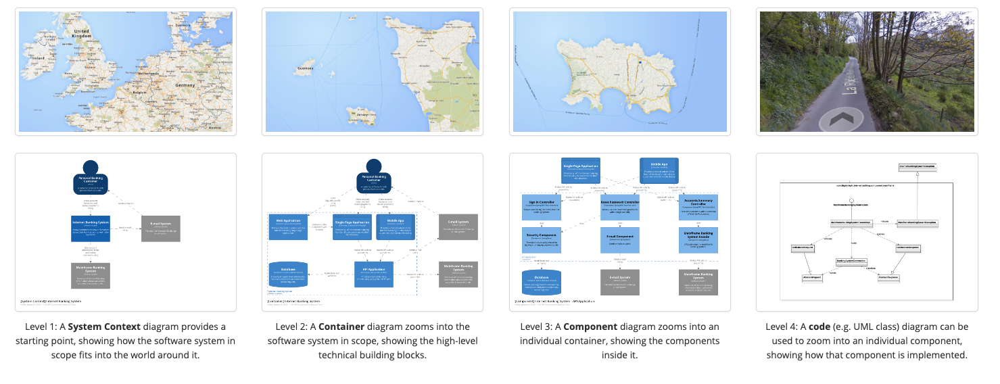

[reference link](https://c4model.com/#ContainerDiagram)

When you're diagramming, it's good to think about what level of details should
you have in your diagrams. Use this C4 model as guidance. 

the C4: 
1. Context => users and systems
2. Container  => single deployable units
3. Components => major structural blocks within a container
4. Code  => code class level
