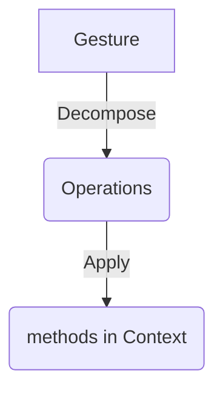

#### Relevant files: 

- [Readme from repo](https://github.com/Workiva/skaardb/blob/master/cerberus/internal/backend/gesture/README.md)
- gesture/framework.go
- operation.go
- model.go
- documentmeta/writer.go
- documentmeta/reader.go


#### Gestures and Operations
In a gist, client calls a gesture, that gets decomposed into operation. 
Each operation will be applied by calling a method in its specific context. 


-------------------------------------------------------------------------------


-------------------------------------------------------------------------------

The gestures and operations come together in framework.go. 

You can see that these are the steps:
1. Gestures enters the [ ProcessGestures ](#processgestures) function that will:
    1. Try to process everything into cache, simulating if all can be processed
    2. If everything goes smoothly, changes will actually be commited, using
       the cache as reference
2. Within the processing, gestures are applied via [ApplyGestures](#applygestures) after initializing & validating access 
3. Within the application, gestures get decomposed via their respective [GetDecomposers](#getdecomposers) method
4. Once fully decomposed, we call [ operation.ApplyDecomposer ](#applydecomposers)
5. Which will retrieve the necessary context and call [ ApplyBaseOps ](#applybaseops)
6. This will call the operation's validate and apply methods. [ Example ](#example-operation).
7. Which will call the corresponding method in its context. In this case, [ documentMetadata ](#example-index)
8. This will update the cache, as stated in item number 1 and will be committed
once all operations are confirmed to be executable successfully

-------------------------------------------------------------------------------

#### Snippets

##### ProcessGestures

<details><summary> processGestures snippet </summary>

```go
func processGestures(opCtx *opcontext.Context, gs []Gesture, useParallelism bool) (*workspace.CommitResult, error) {
	kind, err := processGesturesWithoutCommit(opCtx, gs, useParallelism)
	if err != nil {
		return nil, err
	}
	return commit(opCtx, kind)
}
```

</details>

##### ApplyGestures

<details><summary> ApplyGestures snippet</summary>

```go
// applyGesture applies the Ops created by this Decomposer. If an error occurs it is returned.
// If it is a ComplexDecomposer, then this will iterate over the individual Decomposers.
// Note, this is the equivalent of the function formerly known as operation.Context.ApplyGesture.
func applyGesture(opCtx *opcontext.Context, gesture operation.Decomposer) error {

	if compose, ok := gesture.(operation.ComplexDecomposer); ok {
		var err error
		gestures, err = compose.GetDecomposers(opCtx)
		if err != nil {
			return err
		}

		gestures = bundleContiguousBaseOps(opCtx.DocumentID, gestures)

		if len(gestures) == 0 {
			// Have a singular no-op decomposer, so we attempt to grab base ops from the linking mutators on the opCtx
			// within `operation.ApplyDecomposer` below
			gestures = []operation.Decomposer{operation.BaseOps{}}
		}
	}

	s, ok := gesture.(operation.DecomposerWithSkippableCalc)
	skippable := ok && s.SkipCalcBeforeDecompose()

	f, ok := gesture.(operation.DecomposerWithForcedCalc)
	forced := ok && f.ForceCalcBeforeDecompose()

	canSkipCalc := !forced && (skippable || len(gestures) <= 1)

	for i, g := range gestures {
		opCtx.Context.CheckTermination()

		wasFullyTrimmed, err := operation.ApplyDecomposer(opCtx, g)
		if err != nil {
        /// error handling
		}

		// if we get to this point, we know that this gesture was neither a noop
		// nor completely trimmed
		onlyTrimErrors = false
		onlyNoops = false

		if !canSkipCalc {
			shouldSkip := i < len(gestures)-1
			if shouldSkip {
				_, shouldSkip = gestures[i+1].(operation.BaseOps)
			}

			if !shouldSkip {
				if err := opCtx.PerformLinkMutations(); err != nil {
					return err
				}
				if err := opCtx.WorkspaceServices.Calcer.RunCalc(); err != nil {
					return err
				}
			}
		}
	}

	if onlyNoops || onlyTrimErrors {
		return lastError
	}

	return nil
}


```
</details>

##### GetDecomposers

<details>
<summary> GetDecomposers snippet </summary>

```go
func (g *SetDocumentProperties) GetDecomposers(ctx *opcontext.Context) ([]operation.Decomposer, error) {
	ops := []operation.Base{}

	docCtx, err := ctx.ContextForSourceDocument()
	if err != nil {
		return nil, err
	}

    //  ........................
    //  code omitted for clarity
    //  ........................

	if g.MinApproveTrackChangesPerm != nil {
		oldMinApproveTrackChangesPerm, err := docCtx.Services.DocumentMetadataIndex.GetMinApproveTrackChangesPerm()
		if err != nil {
			return nil, err
		}
		if *g.MinApproveTrackChangesPerm != oldMinApproveTrackChangesPerm {
			ops = append(ops, &operation.SetMinApproveTrackChangesPerm{Value: *g.MinApproveTrackChangesPerm})
		}
	}

    //  ........................
    //  code omitted for clarity
    //  ........................

	return []operation.Decomposer{operation.BaseOps(ops), consumeValuesDecomposer}, nil
}
```

</details>

##### ApplyDecomposers

<details>
<summary>ApplyDecomposers</summary>

```go
// ApplyDecomposer applies the document base operations created by a simple
// Decomposer. This function should only be called from the gesture framework code.
// If an error occurs, it is returned along with a boolean. If the error was the result of the
// operation being completely trimmed, the boolean is true. Otherwise it will be false.
func ApplyDecomposer(opCtx *opcontext.Context, g Decomposer) (bool, error) {

//........
//Code portion in getting the documentOps omitted
//........


//........
//Code portion in various runtime checks (e.g. checking if mutation or calc required) omitted
//........


	// DOCPLAT-10691: Edits made to separate documents should be able to run concurrently to each other.
	for docID, ops := range documentOps {
		opCtx.Context.CheckTermination()

		docCtx, err := opCtx.ContextForDocument(docID)
		if err != nil {
			return false, err
		}

		wasFullyTrimmed, err := applyBaseOps(docCtx, e, g.PreventTrimming(), ops)
		if err != nil {
        /// handle error
		}

		completelyTrimmed = false
		noOp = false
	}

	if completelyTrimmed || noOp {
		return completelyTrimmed, lastError
	}
	return false, nil
}


```

</details>

##### ApplyBaseOps
<details>
<summary> ApplyBaseOps snippet </summary>

```go
func applyBaseOps(docCtx *document.Context, e *logrus.Entry, preventTrimming bool, baseOps []Base) (bool, error) {


	for _, o := range baseOps {

    /// ...
    /// error handling and logging omitted
    /// ...

    /// Validate before applying
		if err := o.Validate(docCtx); err != nil {
			addOperationType(e, o).WithError(err).Warn(`operation.Validate.Error`)
			return false, err
		}
		logOperationProgress(docCtx, o, baseOpTimings, `operation.Validate.Complete`)


    /// Apply the operation
		if err := o.Apply(docCtx); err != nil {
			eOp := addOperationType(e, o)
			if operror.IsNoopError(err) {
				continue
			}
			eOp.WithError(err).Warn(`operation.Apply.Error`)
			return false, err
		}

		logOperationProgress(docCtx, o, baseOpTimings, `operation.Apply.Complete`)

		noOp = false
	}

	if len(trimmedByList) > 0 && (completelyTrimmed || preventTrimming) {
		err := operror.MakeRejectTrimmedError(trimmedByList[0])
		return true, err
	}
	if noOp {
		return false, operror.ErrNoop()
	}
	return false, nil
}
```

</details>

##### Example Operation

<details id=#exampleoperation><summary> SetMinApproveTrackChangesPerm operation snippet </summary>

```go
// Base is an interface for the most basic of operations.
// Eventually all "Handler"s will decompose themselves into a list of Ops
// which will be applied to the indice.
// Ops should be operations which directly modify indices and cannot be
// decomposed into smaller pieces.
type Base interface {
	Apply(docCtx *document.Context) error
	Trim(docCtx *document.Context) (isEmpty bool, trimmedBy []operror.TrimmedBy, err error)
	Validate(docCtx *document.Context) error
}

//Gets implemented by a new base operation
type SetMinApproveTrackChangesPerm struct {
	Value model.MinApproveTrackChangesPerm

	baseNoTrim
}

/// And defining a handler 
func (o *SetMinApproveTrackChangesPerm) Apply(docCtx *document.Context) error {
	return docCtx.Services.DocumentMetadataIndex.SetMinApproveTrackChangesPerm(o.Value)
}
```
</details>


##### Example Index

<details><summary> Document Metadata example writer method </summary>

```go
/// In documentmeta/writer.go
func (w *writer) SetMinApproveTrackChangesPerm(minPerm model.MinApproveTrackChangesPerm) error {
	w.updateCache(MetaKeyMinApproveTrackChangesPerm, &minPerm)
	return nil
}

```


