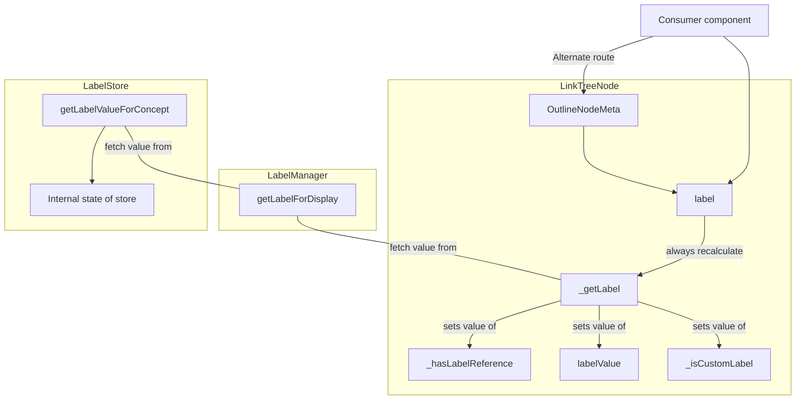

## Summary
Each node in the outline is represented by a LinkTreeNode. While internally
the LinkTreeNode has a labelObj property. The publicly available getter `label`
always recalculate what the actual value of that label, based on the `labelManager`
and the `labelStore`.  That means, if we want to a parameter in the lookup 
process (e.g. language), we need to ensure that the parameter is passed through 
all the chains that makes up
this retrieval process: 

```dart
 linkTreeNode._getLabel()
 LabelManager.getLabelForDisplay()
 LabelStore.getLabelValueForConcept()
```

## Stack trace



#### Snippets

##### LinkTreeNode._getLabel()

<details><summary> _getLabel() in linkTreeNode </summary>

```dart

  // Determine if a custom label has been set for this node.
  String _getLabel() {
    final displayInfo = _labelManager.getLabelForDisplay(
        linkNodeDto?.concept, linkNodeDto?.preferredLabelRole);
    _hasLabelReference = displayInfo.hasLabelReference;
    _isCustomLabel = displayInfo.isCustomLabel;
    labelValue = displayInfo.labelValue;
    _displayLabelOverride = displayInfo.displayOverrideWarning;
    labelValue = displayInfo.labelValue;
    return displayInfo.displayLabel;
  }

```
</details>

##### LabelManager.getLabelForDisplay()

<details><summary> _getLabelForDisplay() </summary>

```dart
  /// Determines the label information needed for the outline for a given
  /// [conceptId] and [role]. If searching the taxonomy for a label we use
  /// [localeId], if that is not provided we use the view-in language.
  DisplayLabelResult getLabelForDisplay(String conceptId, String role,
      {String localeId, bool useFallback = true}) {
    final labelValue = labelStore.getLabelValueForConcept(
        conceptId, role, languageStore.defaultLanguage);

    return DisplayLabelResult()
      ..displayLabel = labelValue?.value
      ..hasLabelReference = labelValue?.isLabelReference ?? false
      ..labelValue = labelValue;
  }

```
</details>

#####  LabelStore.getLabelValueForConcept()

<details><summary> getLabelValueForConcept() </summary>

```dart

  // Determine if a custom label has been set for this node.
/// Returns the label value for a given [conceptId], [role], and [language].
  ///
  /// Note: [language] defaults to taxonomy default language if not provided.
  LabelValue getLabelValueForConcept(
      String conceptId, String role, String language) {
    final label = getLabelByConcept(conceptId);
    if (label == null) return null;
    return label.getLabelValue(role, language);
  }
  ```
</details>


