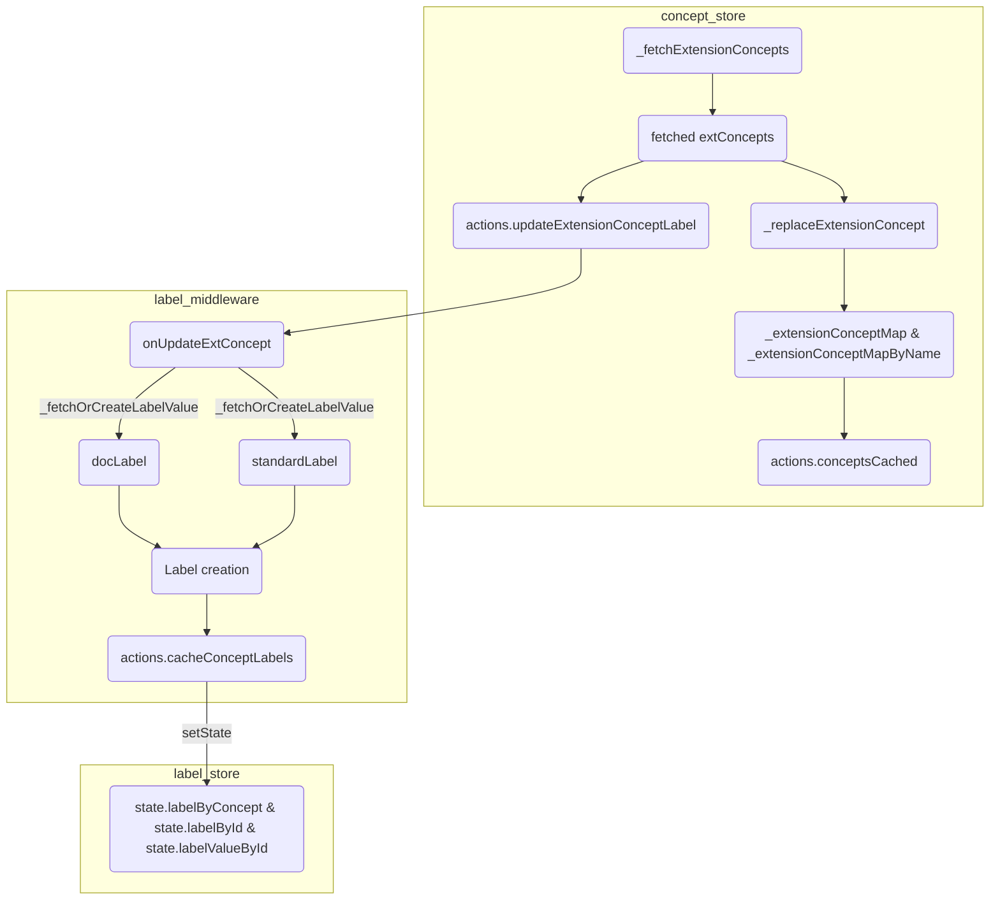
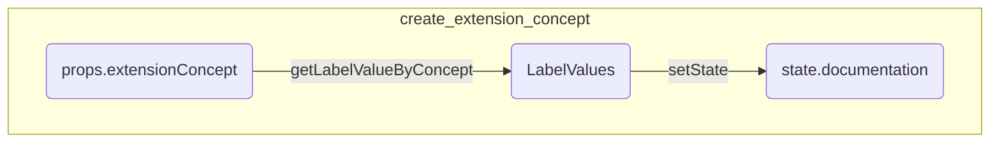
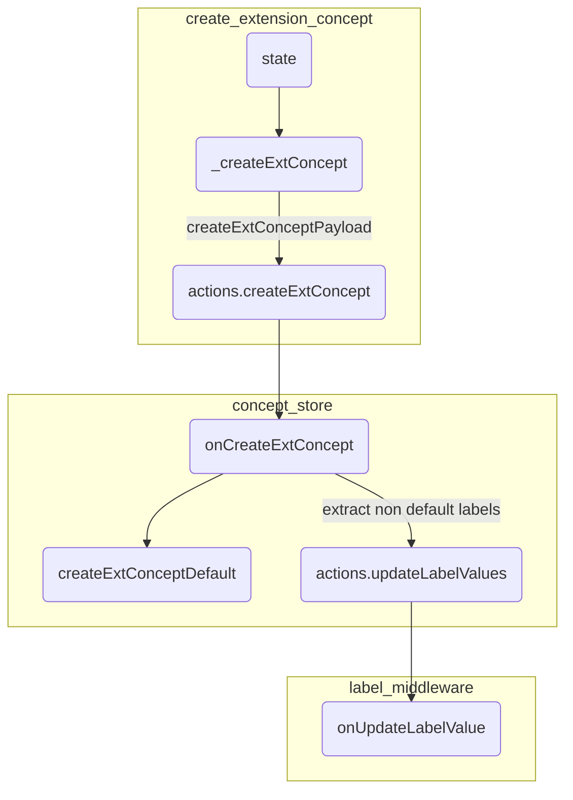

Relevant files: 
- create_extension_concept_component.dart
- label_middleware.dart
- concept_store.dart
- label_store.dart

Prior to multi language, the creation of extension concept component works in these steps: 
- pas
 
 ### Process of normalization of extension concept labels => Label

### Process of retrieval of normalized label to the UI

### Process of creation of Extension Concept and its corresponding labels

